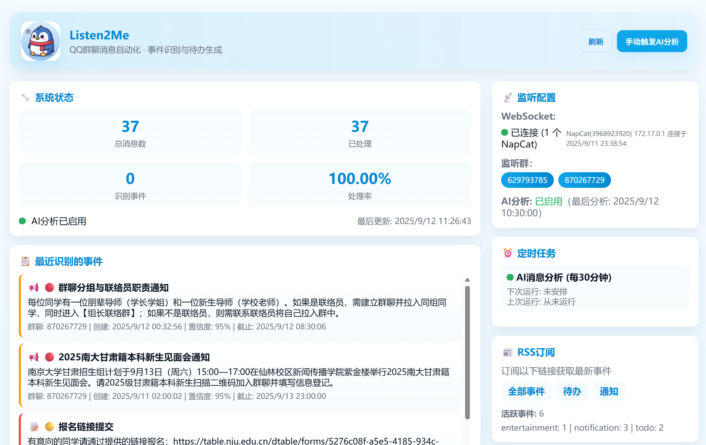

# Listen2Me - QQ群聊消息自动处理

## 项目简介

Listen2Me 是一个基于 NapCat 和 OneBot 11 协议的自动化todo生成平台。通过监听QQ群聊消息，使用AI分析技术自动识别和提取待办事项、通知和文娱活动等信息，并提供RSS订阅功能。

## 主要功能
1. 监听群聊并总结自己需要的东西
2. 练习使用docker，熟悉OneBot协议和NapCat框架的baseline project （just for fun）


## 快速开始
### 前置准备
#### 准备代码
1. 服务器的docker环境
2. clone 代码
3. 运行`cp .env.example .env`并且修改.env其中配置，具体配置请见补充部分。
4. 按照自己需求修改`src/services/aiAnalysisService.js`里面的prompt部分代码

#### 配置NapCat环境
NapCat官方repo：https://github.com/NapNeko/NapCatQQ
NapCat官方文档：https://napneko.github.io/

1. 安装NapCat
2. 在NapCat配置中添加WebSocket反向连接：
> 可以登录napcat的webui进行配置，napcat的webui默认端口为6099
```json
{
  "reverseWs": {
    "enable": true,
    "urls": [
      "ws://127.0.0.1:8081"
    ]
  }
}
```

#### 运行listen2me

### 从原码开始构建

1. 安装依赖

```bash
npm install
```

2. 启动服务

```bash
# 开发模式
npm run dev
# 生产模式
npm start
```
### 使用Docker部署
#### dokcer的一键部署
运行start.sh即可构建docker并且运行

#### 1. 构建docker image
使用docker build . -t '容器的名字'，从dockerfile构建镜像

#### 2. 运行镜像
运行mkdir -p ./data && docker run -p 8080:8080 -p 8081:8081 -v $(pwd)/data:/app/data test


## 补充说明

### .env环境配置

```env


# 监听的群聊ID列表，用逗号分隔
LISTEN_GROUP_IDS=123456789,987654321

# OpenAI兼容的模型配置
OPENAI_API_BASE=https://api.openai.com/v1
OPENAI_API_KEY=your_openai_api_key_here
OPENAI_MODEL=gpt-3.5-turbo

# AI分析配置
AI_ANALYSIS_INTERVAL_MINUTES=30
AI_CONTEXT_WINDOW_HOURS=2
AI_MAX_MESSAGES_PER_ANALYSIS=50

# 数据库配置

DATABASE_PATH=./data/listen2me.db
# 如果是使用docker容器部署，请注意需要外接挂载一个文件夹，比如在项目根目录下运行 mkdir -p ./data && docker run -p 8080:8080 -p 8081:8081 -v $(pwd)/data:/app/data listen2me，即为将$(pwd)/data的卷挂载到docker容器内的/app/data中，实际的数据可以在项目根目录下data/找到

# RSS配置
RSS_TITLE=Listen2Me Todo Feed
RSS_DESCRIPTION=Automated todo and events from monitored groups
RSS_BASE_URL=http://localhost:8080

#管理员qq配置
ADMIN_ID=1234567

```

### 前端界面
原生html，在/public/index.html处修改
### RSS订阅

系统提供多个RSS订阅端点：
- `http://localhost:8080/rss` - 所有事件
- `http://localhost:8080/rss/todo` - 待办事项
- `http://localhost:8080/rss/notification` - 通知
- `http://localhost:8080/rss/entertainment` - 文娱活动

### API接口

- `GET /api/status` - 系统状态
- `GET /api/events` - 获取事件列表
- `POST /api/analysis/trigger` - 手动触发分析
- `GET /api/analysis/stats` - 分析统计信息
- `GET /health` - 健康检查


### 数据库存储
系统使用SQLite数据库存储数据，主要表结构：

- `messages` - 原始消息数据
- `analyzed_events` - AI分析结果
- `system_stats` - 系统统计信息
- `analysis_tasks` - 分析任务记录
### 项目结构

```
listen2me/
├── src/
│   ├── app.js                 # 主应用文件
│   ├── controllers/           # 控制器
│   ├── models/               # 数据模型
│   ├── services/             # 业务服务
│   ├── middlewares/          # 中间件
│   └── utils/                # 工具函数
├── public/                   # 前端静态文件
├── data/                     # 数据库文件
├── logs/                     # 日志文件
├── .env.example             # 配置示例
└── README.md               # 项目说明
```

### TODOs
- 完善消息类型定义
- 增加私聊功能，将消息发给给bot，构建私人信息管理
- 集成通知和推送（目前只支持RSS）
